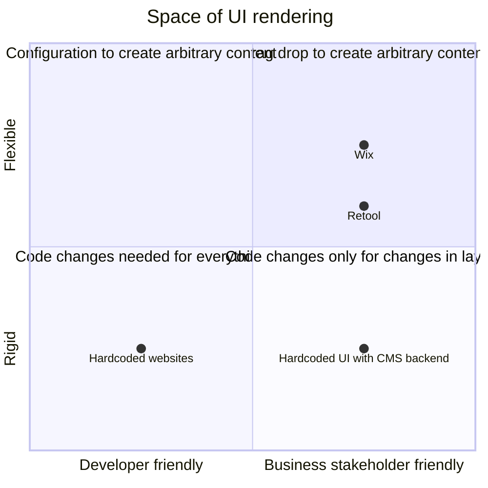

# Roadmap

The goal of a server driven UI framework is to make it possible for a backend
server to determine what a frontend should render based on the data served:

* there is a predetermined set of components that can be rendered
* there is a contract that the backend and frontend both understand
* the backend provides what component needs to be rendered as well as what
  content needs to be populated into that component

In this document I outline the fact that we are interested in developer
friendly tools which render UI - Something a backend developer can
declaratively create in java or python

## Understanding UI backend interaction

There are a lot of ways to configure and talk to a backend and render
components using the returned data

In the following diagram, the x-axis talks about developer friendliness vs
friendliness for a stakeholder or business user who is not a programmer. The
y-axis talks about how much code change is required to update the UI - whether
it's rigid and needs a developer to step in and change the code directly, or
whether we can declaratively modify the UI without writing UI code (Note that
here I'm talking aobut UI code - changing code or configuration files don't
count)

## Opportunity area

Note how quandrant 2 is very bare - developers don't have an easy way to create
UIs for common tasks. In my experience there are mainly a few ways in which
developers create UIs for their work:

* manage data in an SQL table which are served using a RESTful API: GET to get
  all, GET to get by id, POST to update by id, PUT to insert, DELETE to delete
  by id
* dynamically update configuration of a service - update some keys and values
  that change the behavior of a service

Thus our main objective is:

> Create a developer focused server driven UI framework with which we can build
admin UIs for common developer problems

## Plan

### Build out the skeleton of the SDMUI application

The SDMUI application will follow this spec:
1. a simple express app which serves `/app-ui/:url_scheme/:hostname/:path` (for example, a url like `/app-ui/https/localhost:8000/sdmui`)
2. the app should have the ability to load data by hitting `{url_scheme}://{data_hostname}/{data_path}` (using above example, that would be `https://localhost:8000/sdmui`)
3. the app should render some UI components based on that data, however, at the start, this part should return an empty div with a placehold "WIP"

### Iterative prototyping

We will iteratively create a SDUI system in a series of prototypes and refactors.
Each prototype will start with:

* an example express app in `tests/servers` which is a standalone server using port `8181` with one or many `/api/data` endpoints. Each endpoint can be used to read, create, update or delete some dummy data in memory
* one or many `/sdmui/data` endpoints. Each endpoint returns a representation of the data in a format good for rendering
* planned changes to main application `src/` directory to be able to render the UI using that new endpoint
* playwright tests which start the application and the example api, and make sure that the `/http/localhost:8181/sdmui` will render expected components

### Prototypes:

- [Single element](./prototypes/01-single-entity-form.md)
- [Table and TableRow view components](./prototypes/02-table.md)

