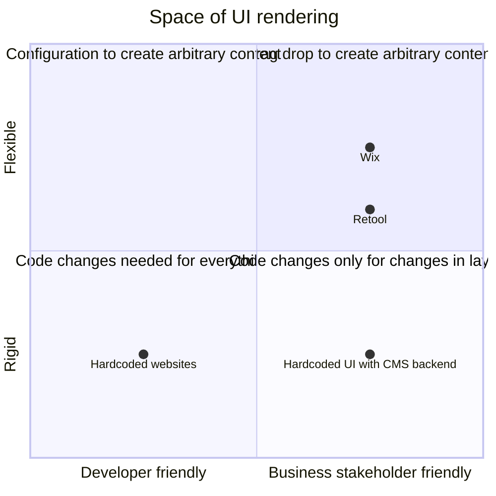

# Roadmap

The goal of a server driven UI framework is to make it possible for a backend
server to determine what a frontend should render:

* there is a predetermined set of components that can be rendered
* there is a contract that the backend and frontend both understand
* the backend provides what component needs to be rendered as well as what
  content needs to be populated into that component

In this document I outline the fact that we are interested in developer
friendly tools which render UI - Something a backend developer can
declaratively create in java or python

## Understanding UI backend interaction

There are a lot of ways to configure and talk to a backend and render
components using the returned data

In the following diagram, the x-axis talks about developer friendliness vs
friendliness for a stakeholder or business user who is not a programmer. The
y-axis talks about how much code change is required to update the UI - whether
it's rigid and needs a developer to step in and change the code directly, or
whether we can declaratively modify the UI without writing UI code (Note that
here I'm talking aobut UI code - changing code or configuration files don't
count)

## Opportunity area

Note how quandrant 2 is very bare - developers don't have an easy way to create
UIs for common tasks. In my experience there are mainly a few ways in which
developers create UIs for their work:

* manage data in an SQL table which are served using a RESTful API: GET to get
  all, GET to get by id, POST to update by id, PUT to insert, DELETE to delete
  by id
* dynamically update configuration of a service - update some keys and values
  that change the behavior of a service

Thus our main objective is:

> Create a developer focused server driven UI framework with which we can build
admin UIs for common developer problems

## Plan

We will iteratively create a SDUI system in a series of prototypes

### Prototype 1: material UI table

use a JSON response from the server render a table:

* use react and material UI component library for list of components that can
  be rendered
* create a contract of `componentName`, `props`, `children` for each component
  to be rendered - this is a basic minimal API which will be iterated on
* render a basic table, without any editing capability

### Prototype 2: material UI table with edits

All of the above with:

* server requesting the frontend to render a form, and the action on the form
  gives us the ability to POST updates, and PUT new entries

### Prototype 3: material UI table with rows that can be edited in place

Instead of a form which updates or inserts, each row in a table can be
triggered to edit and POST-ed to update the value in the row

### Prototype 4: ideantify a grid view or a card view for the same data

Render a different view, having the backend request the frontend to show
different UI elements

### Refactor: identify a better grammer or API

Given a few UIs rendered for the basic use case of a REST api of different
entities, identify a grammar of components that can be composed together to
create higher order components. Have it so rendeing the SDUI on a client is
just a matter of implementing the primitives

